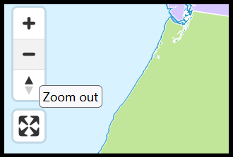

# MapLibre UI Translations

🌍 Community translations for the default MapLibre UI.

- A small plugin to bundle translation files with MapLibre.
- Uses MapLibre’s internal locale (map._locale) to apply
  translations to UI controls.
- Also allows dynamic switching of the locale via a switcher.

> [!IMPORTANT]
> Translation contributions can be made via PR.
>
> Or if preferred, please use the Weblate project hosted here:
> https://hosted.weblate.org/projects/maplibre-ui-translations/maplibre-ui-translations

## MapLibre has text?

Not much, but in a few places such as tooltips:



## Install

```bash
pnpm install maplibre-ui-translations
```

## Usage

### A single locale

```js
import maplibregl from 'maplibre-gl';
// Each translation can be imported by it's 2-letter ISO code
import { fr } from 'maplibre-ui-translations';

new maplibregl.Map({
    container: 'map',
    style: 'https://demotiles.maplibre.org/globe.json',
    center: [0, 0],
    zoom: 2,
    locale: fr,  // Use the variable here
});
```

### Multiple locale options

```ts
import maplibregl from 'maplibre-gl';
// The default English locale
import { defaultLocale } from 'maplibre-gl/src/ui/default_locale';
// Locales from this plugin
import { maplibreLocales } from 'maplibre-ui-translations';

// Set locale from locale switcher, browser context, or another source
const selectedLocaleCode = getUserLocale(); // e.g., "fr" or "pt-BR"
const selectedLocale = { ...defaultLocale, ...(maplibreLocales[selectedLocaleCode] ?? defaultLocale) };

new maplibregl.Map({
    container: 'map',
    style: 'https://demotiles.maplibre.org/globe.json',
    center: [0, 0],
    zoom: 2,
    locale: selectedLocale,
});
```

### Changing the locale after the map has loaded

There is a helper function `updateMaplibreLocale` available for you:

```ts
import maplibregl from 'maplibre-gl';
import { defaultLocale } from 'maplibre-gl/src/ui/default_locale';
import { updateMaplibreLocale, maplibreLocales } from 'maplibre-ui-translations';

const map = new maplibregl.Map({
  container: 'map',
  style: 'https://demotiles.maplibre.org/globe.json',
  center: [0, 0],
  zoom: 2,
  locale: defaultLocale,
});

document.querySelector('#lang-switcher')?.addEventListener('change', (e) => {
  const selectedCode = (e.target as HTMLSelectElement).value;
  updateMaplibreLocale(map, selectedCode);
});
```

### Loading via CDN

```html
<script src="https://cdn.jsdelivr.net/npm/maplibre-ui-translations@latest/dist/maplibre-ui-translations.umd.js"></script>

<script>
    const { updateMaplibreLocale, maplibreLocales, fr, es, de, it, ne, pt, ptBR, ja, ru } = MapLibreUITranslations;
    ...
</script>
```
