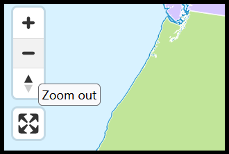

# MapLibre UI Translations

🌍 Community translations for the default MapLibre UI.

- A small plugin to bundle translation files with MapLibre.
- Uses MapLibre’s internal locale (map._locale) to apply
  translations to UI controls.
- Also allows dynamic switching of the locale via a switcher.

> [!IMPORTANT]
> Translation contributions can be made via PR.
>
> Or if preferred, please use the Weblate project hosted here:
> [https://hosted.weblate.org/projects/maplibre-ui-translations/plugin](https://hosted.weblate.org/projects/maplibre-ui-translations/plugin)

## MapLibre has text?

Not much, but in a few places such as tooltips:



## Install

```bash
pnpm install maplibre-ui-translations
```

## Usage

### A single locale

```js
import * as maplibregl from 'maplibre-gl';
// Each translation is exported under its locale code
import { fr } from 'maplibre-ui-translations';

new maplibregl.Map({
    container: 'map',
    style: 'https://demotiles.maplibre.org/globe.json',
    center: [0, 0],
    zoom: 2,
    locale: fr,  // Use the variable here
});
```

### Multiple locale options

```ts
import * as maplibregl from 'maplibre-gl';
import { defaultLocale, maplibreLocales } from 'maplibre-ui-translations';

// Set locale from locale switcher, browser context, or another source
const selectedLocaleCode = getUserLocale(); // e.g., "fr" or "pt-BR"
const selectedLocale = { ...defaultLocale, ...(maplibreLocales[selectedLocaleCode] ?? {}) };

new maplibregl.Map({
    container: 'map',
    style: 'https://demotiles.maplibre.org/globe.json',
    center: [0, 0],
    zoom: 2,
    locale: selectedLocale,
});
```

> [!IMPORTANT]
> If you previously got the English strings from
> `maplibre-gl/src/ui/default_locale`, that deep import no longer resolves in
> MapLibre GL JS 6. This package now ships them itself, as `en` and `defaultLocale`:
>
> ```diff
> - import { defaultLocale } from 'maplibre-gl/src/ui/default_locale';
> + import { defaultLocale } from 'maplibre-ui-translations';
> ```

### Changing the locale after the map has loaded

There is a helper function `updateMaplibreLocale` available for you:

```ts
import * as maplibregl from 'maplibre-gl';
import { updateMaplibreLocale, defaultLocale } from 'maplibre-ui-translations';

const map = new maplibregl.Map({
  container: 'map',
  style: 'https://demotiles.maplibre.org/globe.json',
  center: [0, 0],
  zoom: 2,
  locale: defaultLocale,
});

document.querySelector('#lang-switcher')?.addEventListener('change', (e) => {
  const selectedCode = (e.target as HTMLSelectElement).value;
  updateMaplibreLocale(map, selectedCode);
});
```

Any string a locale does not translate falls back to the English default,
and an unknown locale code logs a warning and falls back to English.

### Loading via CDN

MapLibre GL JS 6 is ESM only, so load both as modules:

```html
<script type="module">
    import * as maplibregl from 'https://unpkg.com/maplibre-gl@6/dist/maplibre-gl.mjs';
    import { updateMaplibreLocale, maplibreLocales, defaultLocale, fr }
        from 'https://cdn.jsdelivr.net/npm/maplibre-ui-translations@latest/dist/maplibre-ui-translations.js';
    ...
</script>
```

## Translation status

A locale below 100% is still safe to use - untranslated strings fall back to English.

[](https://hosted.weblate.org/engage/maplibre-ui-translations/)

## Contributing translations

Translation files live in [`src/locales`](./src/locales) as flat JSON, one per
locale, with [`en.json`](./src/locales/en.json) as the source. Translate the
values only, as the keys are MapLibre's UI string IDs.

To add a locale, copy `en.json` to `src/locales/<code>.json` and translate it.
Nothing else needs editing, since the TypeScript exports are generated from
these files at build time. Every locale must define all of the keys, or
`npm test` fails.

## License

All code is licensed under MIT, see [LICENSE.md](./LICENSE.md).

The translation text content is licensed under
[CC-BY-4.0](https://creativecommons.org/licenses/by/4.0/deed.en),
as listed on the Weblate project.

Both licenses a permissive licenses with very few restrictions,
but cover different use cases (code vs creative content).
